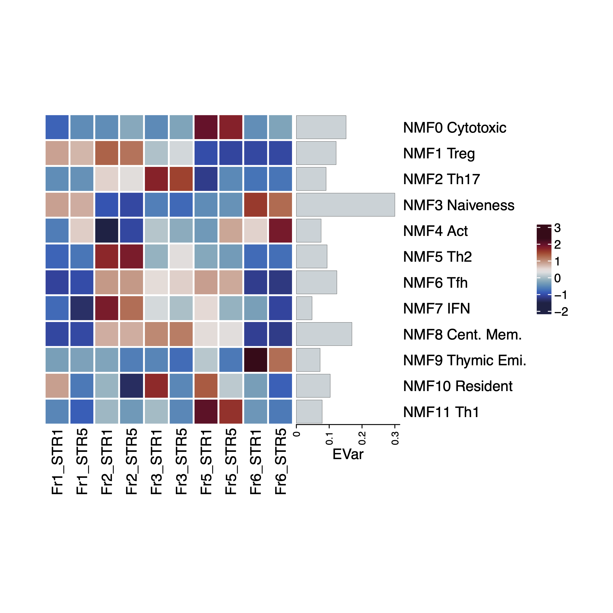

# NMFprojection
Perform NMF decomposition with pre-computed matrix W. For UMI-based pre-computed matrix, input gene expression should be scaledTPM or TPM. 

## Install

After installing python3,

```
pip install numpy scipy pandas scikit-learn scanpy
git clone https://github.com/yyoshiaki/NMFprojection.git
```

## Usage

```
usage: NMFprojection.py [-h] [--outputprefix OUTPUTPREFIX] [--normalized] [--min_mean MIN_MEAN]
 [--max_mean MAX_MEAN] [--min_disp MIN_DISP] [--n_top_genes N_TOP_GENES] [--off_calc_hvg_overlap]
  [--save_fullhvgstats] input fixedW

NMFprojection

positional arguments:
  input                 input csv/tsv of gene expressions. UMI, scaledTPM, TPM can be used. Row: genes, Columns: samples.
  fixedW                input csv/tsv of precomputed W. Row: genes, Columns: components.

optional arguments:
  -h, --help            show this help message and exit
  --outputprefix OUTPUTPREFIX
                        output prefix. default=NMF
  --normalized          if normalized and log transformed, specify this flag.
  --min_mean MIN_MEAN   parameter for calculation of HVGs overlap
  --max_mean MAX_MEAN   parameter for calculation of HVGs overlap
  --min_disp MIN_DISP   parameter for calculation of HVGs overlap.
  --n_top_genes N_TOP_GENES
                        parameter for calculation of HVGs overlap.
  --off_calc_hvg_overlap
                        turn off calc_hvg_overlap
  --save_fullhvgstats   save full stats of hvg (hvg_overlap).
```

example
```
python NMFprojection.py \
    --outputprefix test/STR1.5_Fr1.2.3.5.6 \
    test/STR1.5_Fr1.2.3.5.6_scaledTPM.tsv \
    data/NMF.W.CD4T.csv.gz
```

## Available precomputed NMF W

### Human CD4T cell (pan-autoimmune peripheral CD4T, yasumizu et al., unpublished, UMI-based) : `data/NMF.W.CD4T.csv.gz`

- Factors :
'NMF0 Cytotoxic', 'NMF1 Treg', 'NMF2 Th17', 'NMF3 Naiveness', 'NMF4 Act', 'NMF5 Th2', 'NMF6 Tfh', 'NMF7 IFN', 'NMF8 Cent. Mem.', 'NMF9 Thymic Emi.', 'NMF10 Tissue', 'NMF11 Th1'


### Mouse CD4T cell (pan-autoimmune peripheral CD4T, converted to mouse, yasumizu et al., unpublished, UMI-based) : `data/NMF.W.CD4T.converted.mouse.csv.gz`

Genes were mapped to mouse genes from `NMF.W.CD4T.csv.gz` using the mouse-human homolog list.

- Factors :
'NMF0 Cytotoxic', 'NMF1 Treg', 'NMF2 Th17', 'NMF3 Naiveness', 'NMF4 Act', 'NMF5 Th2', 'NMF6 Tfh', 'NMF7 IFN', 'NMF8 Cent. Mem.', 'NMF9 Thymic Emi.', 'NMF10 Tissue', 'NMF11 Th1'

## Outputs
- *_projection.csv : decomposited H
- *_ExplainedVariance.csv : explained variances (last row indicates Evar of all components)
- *_RMSE.csv : RMSE
- *_hvgstats.txt : stats for hvg_overlap (including POH)
- (*_hvgstats.csv : full stats for hvg_overlap)

We assume NMF W is calculated for highly variable genes (HVGs). To examine whether the selected HVGs of fixed W can capture HVGs in a query dataset, we calculate the proportion of the number of HVGs included in fixed W against the number of HVGs of the query dataset as POH (Proportion of Overlapped HVGs). [`sc.pp.highly_variable_genes`](https://scanpy.readthedocs.io/en/stable/generated/scanpy.pp.highly_variable_genes.html#scanpy.pp.highly_variable_genes) in scanpy is used for the calcuration of HVGs of the query datasets. In default settings, 500 is used for the number of query HVGs.

## Tested environment

- Python==3.8.10
- numpy==1.20.3
- scipy==1.7.1
- pandas==1.3.3
- scikit-learn==0.24.2
- scanpy==1.8.1

## Example of visualization

```{R}
library(tidyverse)
library(ComplexHeatmap)
# library(circlize)
library(pals) 

# setwd("~/NMFprojection")
df.proj <- read.csv("test/STR1.5_Fr1.2.3.5.6_projection.csv", row.names = 1)
df.evar <- read.csv("test/STR1.5_Fr1.2.3.5.6_ExplainedVariance.csv", row.names = 1)

row.labels <- c('NMF0 Cytotoxic', 'NMF1 Treg', 'NMF2 Th17', 'NMF3 Naiveness', 
  'NMF4 Act', 'NMF5 Th2', 'NMF6 Tfh', 'NMF7 IFN', 'NMF8 Cent. Mem.',
  'NMF9 Thymic Emi.', 'NMF10 Resident', 'NMF11 Th1')

# raw value
anno = row_anno_barplot(
  df.evar$ExplainedVariance[1:dim(df.evar)[1]-1],
  border = FALSE, bar_width = 0.9, 
  gp = gpar(fill = cividis(10)[4], lwd = 0),
  width = unit(3, "cm"))
Heatmap(df.proj, name=" ",
        row_order = rownames(df.proj), column_order = colnames(df.proj),
        right_annotation = rowAnnotation(EVar = anno, simple_anno_size = unit(4, "cm")),
        col = cividis(40), row_labels = row.labels, 
        rect_gp = gpar(col = "white", lwd = 2),
        width = ncol(mat)*unit(3, "mm"), 
        height = nrow(mat)*unit(5, "mm")
)

# scaled value
anno = row_anno_barplot(
  df.evar$ExplainedVariance[1:dim(df.evar)[1]-1],
  border = FALSE, bar_width = 0.9, 
  gp = gpar(fill = ocean.balance(10)[5], lwd = 0),
  width = unit(3, "cm"))
p <- Heatmap(t(scale(t(df.proj))), name=" ",
             row_order = rownames(df.proj), column_order = colnames(df.proj),
             right_annotation = rowAnnotation(EVar = anno, simple_anno_size = unit(4, "cm")),
             col = colorRamp2(seq(-3, 3, length = 20), ocean.balance(20)),
             row_labels = row.labels, 
             rect_gp = gpar(col = "white", lwd = 2),
             width = ncol(mat)*unit(5, "mm"), 
             height = nrow(mat)*unit(5, "mm"),
             column_split = colnames(df.proj) %>% str_extract("Fr.")
)
p

pdf("test/STR1.5_Fr1.2.3.5.6_heatmap_zscore.pdf")
p
dev.off()
```


